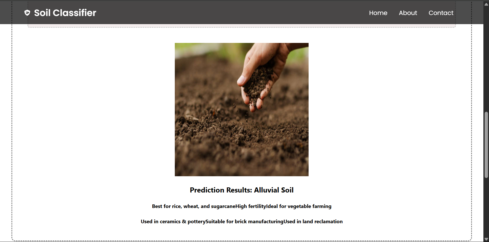

# 🌱 Soil Classifier - Deep Learning Based Soil Type Prediction

A web-based soil classification system that predicts the type of soil based on input images using a Convolutional Neural Network (CNN). This project demonstrates how deep learning can be applied in agriculture to assist in soil identification, supporting better crop planning and land use.

---

## 🔗 Project Link

**Live Demo**: [Soil Classifier App](https://nithin521-soil-classifier.hf.space/)  
**GitHub Repository**: [https://github.com/nithin521/soil-classifier](https://github.com/nithin521/soil-classifier)

---

## 📌 Table of Contents

- [About the Project](#about-the-project)
- [Technologies Used](#technologies-used)
- [Dataset Source](#dataset-source)
- [Model Architecture & Training](#model-architecture--training)
- [How to Run Locally](#how-to-run-locally)
- [Results](#results)


---

## 📖 About the Project

This project aims to classify soil types using image inputs. It leverages deep learning (CNN) for classification, and provides a user-friendly web interface for uploading and predicting soil types.

---

## 🛠️ Technologies Used

### 🔍 Machine Learning
- **TensorFlow** & **Keras** - for building and training CNN models.
- **NumPy**, **Pandas**, **Matplotlib** - for data processing and visualization.
- **OpenCV** - for image preprocessing.

### 🌐 Web Interface
- **Gradio** - for building the interactive frontend.
- **Hugging Face Spaces** - for model deployment and hosting.

### 🐍 Python Libraries
- `os`, `random`, `sklearn`, etc.

---

## 📂 Dataset Source

We used a publicly available soil image dataset from **Kaggle**:

📊 **Classes**:  
- Alluvial Soil  
- Black Soil  
- Red Soil  
- Clay Soil


📸 Each class contains multiple image samples of real soil captured under various lighting and environmental conditions.

---

## 🧠 Model Architecture & Training

We used a Convolutional Neural Network (CNN) with the following configuration:

### 📐 Model Architecture:
- **Input Layer**: 128x128x3 resized RGB images
- **Convolutional Layers**: 2-3 Conv2D layers with ReLU activations
- **Pooling Layers**: MaxPooling after each Conv layer
- **Dropout**: To prevent overfitting
- **Flatten & Dense Layers**: Fully connected layers leading to final output
- **Output Layer**: Softmax activation for multiclass classification

### 🧪 Training:
- **Epochs**: 20
- **Optimizer**: Adam
- **Loss Function**: Categorical Crossentropy
- **Accuracy Achieved**: ~92% on validation set
- **Data Augmentation**: Applied for better generalization (rotation, flip, zoom)

---

## 🖥️ How to Run Locally

### ⚙️ Requirements:
```bash
pip install -r requirements.txt 
```


## Results
Achieves ~90–92% accuracy on validation soil images.

Clean React UI for uploading and drag-and-drop.



